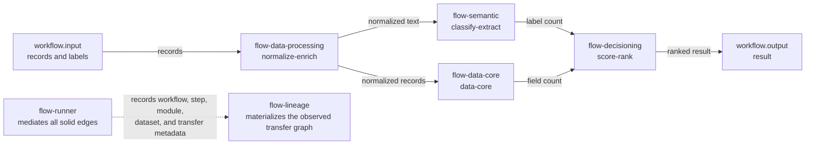

# flow-runner

`flow-runner` executes arbitrary module DAGs while recording the actual data movement. It is
domain-neutral infrastructure: module order is defined by each workflow, so the same two modules
can run in either direction in different workflows.

## Guarantees

- Branch and merge DAG scheduling with a configurable parallelism limit (default 4).
- JMESPath-only bindings and conditions. A step may only reference declared upstream steps.
- Module contract discovery through `GET /v1/modules`, JSON Schema validation, and execution
  through `POST /v1/run`.
- 10 MiB payload limit, 30-second request timeout, and two retries for transport/5xx failures.
- Durable MongoDB outbox in `flow_runtime`. A module is not called before its OpenLineage START
  event is acknowledged, and its output is not exposed downstream before COMPLETE is acknowledged.
- Pending outbox events from an interrupted process are replayed and acknowledged during startup;
  startup fails closed while the lineage collector is unavailable.
- Raw inputs and outputs are never persisted. Run state and lineage retain canonical SHA-256,
  byte count, record count, and schema reference only.
- Standard OpenLineage parent-run facets plus public `flow_*` facets. Optional Flowprint emission
  uses the same root run ID.

## Repository topology and data flow

`flow-runner` is the orchestrator. Module repositories do not call one another directly: the
runner discovers each versioned contract, validates the step input, invokes the module, validates
its output, and binds that output into downstream steps. A workflow may therefore connect the
module repositories in any valid DAG rather than following one fixed pipeline.

```mermaid
flowchart TB
    Caller["Workflow caller<br/>DAG and input payload"]
    Stack["flow-stack<br/>Private on-demand composition<br/>and deployment registry"]
    Runner["flow-runner<br/>DAG validation, scheduling,<br/>binding, retries, and fail-closed execution"]
    Lineage["flow-lineage<br/>Immutable run events, project/module graph,<br/>dataset movement, and impact queries"]
    Result["Workflow consumer<br/>Selected workflow outputs"]

    subgraph Foundations["Reusable foundation repositories"]
        ServiceCore["flow-service-core<br/>Wire contracts and runtime dispatch"]
        DataCore["flow-data-core<br/>Data validation and workflow primitives"]
        ModelCore["flow-model-core<br/>Model execution and assurance primitives"]
    end

    subgraph Capabilities["Capability repositories"]
        Processing["flow-data-processing<br/>Ingest, normalize, enrich, ETL,<br/>and data quality"]
        Semantic["flow-semantic<br/>Classify, extract, embed, retrieve,<br/>and grounded context"]
        Vision["flow-vision<br/>Image-matrix and document-text analysis"]
        Industrial["flow-industrial<br/>Telemetry, protocol checks, SPC,<br/>and traceability"]
        Decisioning["flow-decisioning<br/>Score, rank, match, recommend,<br/>forecast, and optimize"]
        Observability["flow-observability<br/>Time-series aggregation, anomaly/drift,<br/>and KPI reporting"]
    end

    Caller -->|"workflow input"| Runner
    Stack -. "compose and register deployments" .-> Runner
    Runner <-->|"contract discovery and validated step I/O"| ServiceCore
    Runner <-->|"contract discovery and validated step I/O"| DataCore
    Runner <-->|"contract discovery and validated step I/O"| ModelCore
    Runner <-->|"contract discovery and validated step I/O"| Processing
    Runner <-->|"contract discovery and validated step I/O"| Semantic
    Runner <-->|"contract discovery and validated step I/O"| Vision
    Runner <-->|"contract discovery and validated step I/O"| Industrial
    Runner <-->|"contract discovery and validated step I/O"| Decisioning
    Runner <-->|"contract discovery and validated step I/O"| Observability
    Runner -. "START / COMPLETE / FAIL events;<br/>dataset references and transfer facets" .-> Lineage
    Runner -->|"workflow output"| Result
```



Solid edges carry workflow or step data through the runner. Dotted edges are deployment control
or metadata-only lineage traffic. `flow-lineage` receives hashes, byte and record counts, schema
references, bindings, and source/destination relationships—not raw module payloads. `flow-stack`
currently composes the runner, lineage collector, and a selected runnable subset of module
repositories; the registry can add deployments without changing the runner.

The checked-in [branch/merge example](examples/branch-merge.yaml) produces this observed movement.
Every solid module-to-module edge below is mediated and validated by `flow-runner`; it is stored by
`flow-lineage` as an exact source step, source module, source dataset, and destination module
relationship.



## Workflow

```yaml
schema_version: "1.0"
workflow: {id: example, version: "1.0.0", max_parallel: 4}
steps:
  - id: first
    module: module-a/normalize@1.0.0
    bindings: {records: workflow.input.records}
  - id: second
    module: module-b/score@1.0.0
    needs: [first]
    when: steps.first.output.records != null
    bindings: {records: steps.first.output.records}
outputs: {result: steps.second.output}
```

Step IDs are restricted to JMESPath-safe identifiers. Binding defaults must be declared as
`{source: path, optional: true, default: value}`. Cycles, unknown dependencies, and references to
non-upstream steps are rejected before execution.

## Commands

```bash
uv sync --extra dev
uv run flow-runner validate examples/branch-merge.yaml
FLOW_REGISTRY_PATH=/secure/registry.yaml uv run flow-runner plan examples/forward.yaml
FLOW_REGISTRY_PATH=/secure/registry.yaml uv run flow-runner run examples/forward.yaml \
  --input '{"points":[{"value":1},{"value":2},{"value":3}]}'
FLOW_REGISTRY_PATH=/secure/registry.yaml uv run flow-runner status RUN_ID
uv run pytest -q
uv run ruff check .
```

The private deployment registry maps versioned module refs to base URLs and optional environment
variable names holding bearer tokens. Do not put endpoint credentials in workflow documents or the
public repository.

The API exposes `POST /v1/runs`, `GET /v1/runs/{run_id}`, and `GET /healthz`. The default Compose
binding is `127.0.0.1:18090`; the stack is on-demand and should be stopped after use.

```bash
FLOW_REGISTRY_FILE=/secure/registry.yaml \
FLOW_MONGODB_URI='mongodb://...@mongodb:27017/' \
FLOW_LINEAGE_TOKEN='...' docker compose up --build -d
docker compose stop
```

The standalone Compose file joins existing `flow-net` and MongoDB networks. The private
`flow-stack` deployment owns those networks and supplies the lineage and module services.
